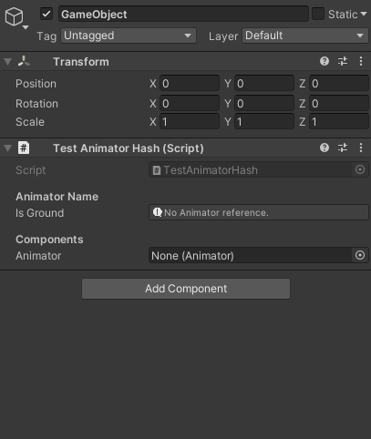

# Animator Hash

Unity Attribute property that able to select **Animation Controller Parameter** and optimized by using on Interger field as **AnimatorHash**.



Created by Thanut Panichyotai (@[LuviKunG](https://github.com/LuviKunG))

## Why?

Using hash to labeled **Animation Controller Parameter** is good performance.

On runtime when animator parameter is executed (such as ```animator.SetBool("thisIsBool");```), Unity Engine will be transform **string** to **int** as hash before doing iteration every parameter's in **Animation Controller** (see more info [https://www.youtube.com/watch?v=ZRDHEqy2uPI](https://www.youtube.com/watch?v=ZRDHEqy2uPI))

## How to use?

Implement **AnimatorHash** attribute on integer, and label serialize field to name of **Animator** in the same object (or components), like this example.

```csharp
public class TestAnimatorHash : MonoBehaviour
{
    [AnimatorHash("m_animator")]
    public int animationName;

    public Animator m_animator;

    public void PlayCharacterMove(float moveSpeed)
    {
        m_animator.SetFloat(animationName, moveSpeed);
    }
}
```