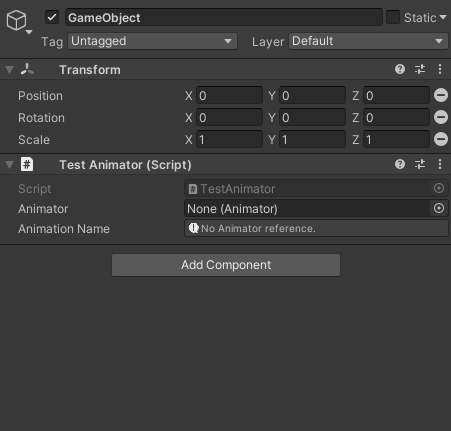

# Animator Name

Unity Attribute property that able to select **Animation State** in **Animator State Machine** layer by layer and optimized by using on Interger field as **AnimatorNameAttribute**.



Created by Thanut Panichyotai (@[LuviKunG](https://github.com/LuviKunG))

## Why?

Using hash to labeled **Animation State** is good performance. (Better than using as a string)

On runtime when animator parameter is executed (such as ```animator.Play("stateName");```), Unity Engine will be transform **string** to **int** as hash before doing iteration every parameter's in **Animation State Machine Controller** (see more info [https://www.youtube.com/watch?v=ZRDHEqy2uPI](https://www.youtube.com/watch?v=ZRDHEqy2uPI))

## How to use?

Implement **AnimatorName** attribute on integer, and label serialize field to name of **Animator** in the same object (or components), like this example.

```csharp
public class TestAnimatorName : MonoBehaviour
{
    [AnimatorName("m_animator")]
    public int stateMove;

    public Animator animator;

    public void ChangeStateToMove()
    {
        animator.Play(stateMove);
    }
}
```