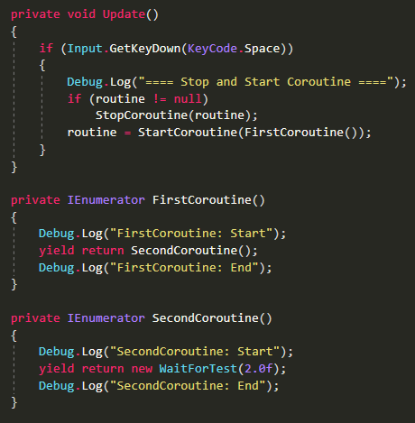

# LayerCoroutine

The story starts with my Game Developer, He's reported to me about a strange thing in Coroutine, about to stop the main coroutine but the coroutine inside isn't even stop.

By default, When you start a coroutine and you have to start another coroutine inside the first coroutine, It should be used the separate coroutine. But if you start a coroutine and yield with another IEnumerator, that IEnumerator should still working with in first coroutine!

So in this example, I've simulate this code to show how it's work.



I've an input on the spacebar button. It's stop the current coroutine activity and start the new one on the ```FirstCoroutine()```

As you see, I've my ```CustomYieldInstruction``` in the ```SecondCoroutine()``` method. It's inside look like this.


Yes, It's look like ```WaitForSeconds(float)``` that Unity provide us. But why I didn't use that instead? Because I need to create my ```CustomYieldInstruction``` that using in another purpose (like making AI). This is just simulate the trouble.

The result is, It's working fine!


I pressed the input to stop the current coroutine activity and start the new one. (Yes, it's mean restart the coroutine) You will see that I've press four times until I let it done.

Yes, I called it **Layering Coroutine** technique. And this example are show as two layering coroutine.

The trouble starts with **three or more** layering coroutine.


I've put another layer of coroutine named ```ThirdCoroutine()``` and make it layering each other.

And here's result...


Unity are not stop the layering coroutine anymore. They let the ```SecondCoroutine``` and ```ThirdCoroutine``` running behind and stop only on the ```FirstCoroutine```.

This is sucks. So I've to dive into native Unity Engine. (Sorry, I can't tell you how...) And take a look at ```CustomYieldInstruction``` and ```YieldInstruction```.

**YieldInstruction**


**CustomYieldInstruction**


You see the difference? ```YieldInstruction``` are **not inherit** from anything and labeled with attribute ```[UsedByNativeCode]``` but ```CustomYieldInstruction``` are abstract class that inherit IEnumerator.

That's mean ```CustomYieldInstruction``` are IEnumerator and will working same as you create another IEnumerator to do your purpose. That's not different from doing layering coroutine.

But ```YieldInstruction``` are used in **native, internally and no parameters**.

What is that mean? That's mean Unity Engine, maybe, using ```YieldInstruction``` and do the switch case to execute internally. And we cannot doing anything on ```YieldInstruction```.

Why does I care about using between ```YieldInstruction``` or ```CustomYieldInstruction```? I'll show you right here.

Unity **WaitForSeconds** using ```YieldInstruction```


Unity **WaitWhile** using ```CustomYieldInstruction```


And here's different. I've made two test-case between ```WaitForSeconds``` and ```WaitWhile```.


I've made some changes on the ```ThirdCoroutine()``` to use ```WaitForSeconds```. And here's result.


```WaitForSeconds``` are working correctly as **Layering Coroutine**.

So, this time for ```WaitWhile```.


It's working like a wait for 2 seconds, same as above.

And here's result...


They are not **Layering coroutine** anymore!

**WHY? UNITY, WHY!?**

To fix this trouble is report to Unity Developer and hope they will fix this in 2 years later... I'm serious.

So, How to work around on this troble is, use ```LayerCoroutine``` class that I've made. Here's code on the example that I attached to this repo too.


Instead of using ```StartCoroutine``` from ```MonoBehaviour```, you need to create ```new LayerCoroutine(MonoBehaviour)``` as a parameter. and use it like ```layer.StartCoroutine(IEnumerator)```.
This will make coroutine that you started are layered inside of ```LayerCoroutine``` class.
And to stop the coroutine, use ```layer.StopAllCoroutine()``` to stop all layering coroutine.

As you see, I'm put another layer called ```FourthCoroutine()``` too. And here's result!


Now it's working fine as **Layering Coroutine**.

Thanks for reading!