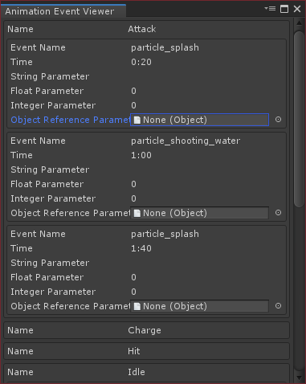

# LuviTools

Some useful unity plugins, created by Thanut Panichyotai (@[LuviKunG](https://github.com/LuviKunG))

## Version History

### November 26th 2020

- Add **Interaction Manager**
  - For blocking 'Double Request' or spamming on interactive elements.
  - Using with all interaction section (eg. User Interface, WebSocket connection)
  - Already contains usage and information via C# XML comment in class.

### September 21st 2020

- Add **PreprocessThaiText**
  - Using with LexTo C# Library and Thai Font Adjuster.
  - LexTo C# is not available right now.

### September 20th 2020

- Add **AnimatorNameAttribute**
  - [Click here for more information](Attribute/AnimatorName)
- Change name of **AnimatorHashAttribute** into **AnimatorParameterAttribute** instead.

### August 25th 2020

- Add **Bounds2D**.
  - It's bounds that using `Vector2` to calculate bounds.
  - Includes all features from `Bounds` such as `Contains` `Intersects` and `Expand`.
- Improve **Visual Studio 2019 Monokai Theme**.

### July 16th 2020

- Add **IMGUI Menu**.
  - Using for making quick command for test via IMGUI. By inherit and add command of your choices.
  - No instruction will available right now.
- Add **Disabled Group Scope**.
  - It's IMGUI Scope that not available in UnityEngine Assembly. So I just make one that look like it.

### July 7th 2020

- Add **Animator Hash** attribute.
  - [Click here for more information](Attribute/AnimationHash)

### June 18th 2020

- Fix **Camera Aspect Ratio**.
  - Zoom scale didn't apply during in 'width' mode. (both runtime and editor)

### January 3rd 2020

- Add **Animation Event Viewer** Editor.

  

  - Multiple select on Animation Clip and right click, select **_'LuviKunG > Animation Event Viewer'_** menu to open editor window.

- From now on, I'll trying to rearrange all tools and serparate by Assembly Definition. So that will making easily to add/remove from Unity Project and faster complie time.

### December 20th 2019

- Add **StringInput** Attribute.
  - Define to string to act as selectable in inspector.

### October 8th 2019

- Add new **Better Button**.
  - Just a Unity UI Button with onUp & onDown Unity Events.
- Add **URL**.
  - Tools that able to parse query into Dictionary and able to add, remove or modify parameters.
- Add **Loop**.
  - Like a List but able to get current, next or previous object index.
- Add **Parallax**.
  - It's a tools that help transform to parallax.
- Update **StringSceneAttribute**.
  - Add default constructor.
- Update **GUIDebug**.
  - Add word wrap to label.
- Remove old **Loop**.
- Remove **Post Process Build WebGL** because it's already include in [Build Pipeline for WebGL](https://github.com/LuviKunG/BuildPipelineWebGL).
- Relocate **Limit**.

### September 26th 2019

- Add Legacy GUI Debug.
  - It's smaller version of LuviConsole.
  - I'm used it during debugging on WebGL in mobile.
- Add Post Process Build WebGL that able to remove warning in mobile.
  - _Still need more improvement! (like UI window in Unity) So wait for me!_
- Remove these plugins from this repository, because it's already created as repository UPM. (Click on the name to redirect to it's repository UPM)
  - [LuviConsole](https://github.com/LuviKunG/LuviConsole).
  - [Mipmap Bias Editor](https://github.com/LuviKunG/MipMapBiasEditor).
  - [Scripting Define Symbols Editor](https://github.com/LuviKunG/ScriptDefineSymbolsEditor).
  - [Build Pipeline for Android](https://github.com/LuviKunG/AndroidBuildPipeline).

### September 17th 2019

- Add new **Touchable (Image Mask)**
  - Same as **Touchable** but able to set Image to check alpha of the image to raycast.
  - Must enable 'Read/Write Enable' on the sprite's texture to use this.

### August 26th 2019

- Add new **LuviSocketIO** (Client side only)
  - Using with Node.js SocketIO.
  - Still in development and improvement.

### August 17th 2019

- Update **Camera Aspect Ratio**
  - Add **Width** mode to lock the camera aspect by width (instead of default of height).
  - Update Inspectator GUI.
  - Fix NullReferenceException when target camera is null while selecting the component's game object.

### August 7th 2019

- **Mipmap Bias**
  - Remove menu from 'Window > Mip Map Bias'.
  - User can single select, multiple select or folder select, then using 'Assets > LuviKunG > Open Mipmap Bias Window' menu to open the editor window with selecting content.
  - Remove input of float to set bias because it's useless.
  - Now using enum popup to select the value of mip map bias instead.
- Deprecated **Camera Aspect**
- Update **Camera Aspect Ratio**
  - Include option to select the aspect ratio mode between 'Expand' or 'Shrink', similar with UnityUI Canvas.
  - No longer execute in edit mode.
  - By selecting the component's game object, it will update the aspect ratio by automatically.
- Deprecated **Combine Assets**
- Add new **Assets Management**
  - List GUI with icon type.
  - Able to combine assets.
  - Able to rename sub assets.
  - Able to show or hide sub assets.
- **Positioning**
  - Remove two options in `PivotPosition` because it's same as the old option with inverse size.

### August 6th 2019

- New **Scripting Define Symbols Editor**
  - Simply add/remove/reorder element of scripting define symbols element.
  - Serparate option for every build target groups.
- **Build Pipeline for Android**
  - Add editor option for increase bundle version number everytime that user perform to build.

### August 1st 2019

- Big day update!
- **Android Management**
  - New option for **Keyboard Input** that you can choose to hide input or not.
- **Attribute**
  - Fix **EnumFlag** cannot select the choice that value of ~0 byte.
  - Add **LayerAttribute** to int type for layer selection in Unity Inspector.
- New **Build Pipeline for Android**
  - Setting your build settings at first (include keystore)
  - Choose the folder to build \*.apk
  - Build with one click!
- Add new **Capture Screenshot (for editor)**
  - Included with supersampling.
  - Required **IntPopup** attribute.
- **Extension**
  - **IListExtension** not require `LuviKunG.List` namespace.
- **FPS Meter**
  - Add **FPSMeterLegacyGUI** for easily and quick to check FPS without doing uGUI.
- **Pool**
  - Add **Pool** class. It's a dynamic pooling that can instantiate prefab within target transform, include instantiate event, and require interface of **IPool** to check the member is active or not.
- **Thai Font Adjuster Pack**
  - Fix null string broke the adjuster class.
  - Add **TextThaiGlyph** that act like **Text** of `UnityEngine.UI` but include thai character adjuster string.
  - Add **ThaiCharacterReplacer** & **ThaiCharacterReplacerTMP** to help put thai character into **Text** or **TextMeshProUGUI** components.
- **UnityUI**
  - Add **ButtonToggle** to act like button + toggle that can switch between two group of GameObject that show active/inactive state.
- **User Interface Management**
  - Change **UserInterfaceBehaviour** class that handle GameObject reference of yourself.
  - Fix **UserInterfaceSound** with wrong namespace and reference.
- **Utilities**
  - Fix **Loop** that handle wrong initial index.
  - Add **FloatRange** and **IntRange** to define the range of numbers.
- **LuviConsole**
  - Fix changes are not save via Unity Inspector.
- Simplified many script.
- Remove unused namespace.

### July 10th 2019

- Add **Extended Unity UI 2018.4** for Unity UI.
  - Description in this [readme.md](UnityUI/Extended%20Unity%20UI%202018.4/readme.md)
- Add new extension of `StringBuilderRichTextExtension`.
  - Help to add color, bold, italic while using `System.Text.StringBuilder`.
- Add new **User Interface Management** components.
  - Really & very helpful for manage **Android Back Button**
  - Using focusing and ordering.
- Update `LuviConsole` to version 2.4.1
  - New **Command Group** has been added. Using for grouping your command.
  - New **Execute Command Immediately** has been added. Will execute the command instantly when press the command button.
  - Remove internal Rich Text display for Log. But...
  - Require extension of `StringBuilderRichTextExtension` to display rich text in Log.
  - New **Command Log** to display your executed command in Log.
- Update `IListExtension`
  - Add new `ListIteration<T>` for `Each<T>` to execute each of member.

### June 28th 2019

- Deprecated `Enchant List` but...
- Add new List in **Utilities**.
  - `Loop` for loop the member in list while using Next or Prev.
  - `Limit` it's list that when adding new member will remove first-in member if it's reach to limit.
- Add `RandomString` for random string.
- Add `Setter` for making extension that receive member and set it back without doing cache.
  - Example in this [readme.md](Utilities/Setter/readme.md)
- Add `StringScene` to making string field into Scene Selection in Inspector.
- Update `StringPath`, `StringPopup`, `IntPopup` to show an error if using the attribute in the wrong type.

### June 26th 2019

- Add `ThaiCharacterReplacerTMP` in Thai Font Adjuster Pack for Text Mesh Pro for typing Thai character.

### June 25th 2019

- Add `DateTimeExtension`
  - Print ISO 8601 format with `DateTime.Now.ISO8601();`
  - [https://en.wikipedia.org/wiki/ISO_8601](https://en.wikipedia.org/wiki/ISO_8601)

### June 20th 2019

- <del>Update `LuviConsole` to version 2.3.7</del>
  - <del>WebGL support.</del>
- Update `LuviConsole` to version 2.4.0
  - WebGL support.
  - New drag scroll view on log. (all platform)
  - New LuviCommand syntax.
    - Now you can use string in your command by using quote "Your string here" to get full string without serparate by space.
    - Fix bugs that execute by double quote and got an error.
  - Realtime update window size and orientation.
  - Require to start with `using LuviKunG;`
  - Add `LuviConsoleException` to throw error during execute command.
- Update **Monokai2019.vstheme**
  - Include various monokai color window.

### June 17th 2019

- Add **Monokai2019.vstheme** for Visual Studio Community 2019

### June 10th 2019

- Add `IListExtension` which include two useful method.
  - `Shuffle()` to shuffle all member in list.
  - `Combination(int sample)` to get all possible combination of sample in list.
- Deprecated 2 class, because Unity 2018 or better version are support C# 7.0 and it's already included these extension method.
  - `EnumExtension` of `bool HasFlag(enum flags)` and `bool TryParse<TEnum>(string s)`
  - `StringBuilderExtension` of `void Clear()`
- Change `RichTextHelper` into `RichTextExtension` which using namespace **LuviKunG.RichText;**

### June 5th 2019

- Update `Gacha` class.
  - Add `Clear()` to clear all gacha elements.
  - Fix error that was using BitStrap
  - Changes for loop instead of foreach loop.

### June 3rd 2019

- Update `LuviConsole` to version 2.3.6
  - Upgrade compatible with Unity version 5, 2018 and 2019.
  - Rearrange the inspectator.
  - Add new unity instantiate menu on GameObject > LuviKunG > LuviConsole.

### May 27th 2019

- Add `MonoBehaviourUI` class. This is helping to get `RectTransform` from components in easier way.
- Move **Yield Instruction** to deprecate state.

### April 17th 2019

- Add `StringPath` attribute.
  - change `string` property into path selection window.

### March 8th 2019

- Add `LayerCoroutine` class.
  - Why? Because **Unity are sucks**. They changed `YieldInstruction` to used by native inside of `MonoBehaviour` and they completely broke `CustomYieldInstruction`. Here is [why](Layer%20Coroutine/readme.md)

### February 28th 2019

- Add visual studio community theme. Require [Color Theme Editor for Visual Studio 2017](https://marketplace.visualstudio.com/items?itemName=VisualStudioPlatformTeam.VisualStudio2017ColorThemeEditor) and [Color Themes for Visual Studio](https://marketplace.visualstudio.com/items?itemName=VisualStudioPlatformTeam.ColorThemesforVisualStudio)
  - Monokai (Dark)

### February 21st 2019

- Add Camera Sorting component.
- Using for set a custom transparant sorting by axis per camera.
- Update Camera Aspect component.
- Update full README.md on previous update.

### February 9th 2019

- Add and Update many new components.
- Deprecated components.
  - Apply Selected Prefabs
    - No longer support because it's obsolete in Unity version 2019 and greater.
  - CameraPPU
    - No longer support because it's have new component instead.
  - Game Configuration
    - No longer support because it's have new component instead.
  - and other... No longer support because it's sucks.
- Add Yield Instruction component.
  - `WaitForCondition`: Using in coroutine by `yield return new WaitForCondition(isReady);`
  - `WaitForTimeSpan`: Using in coroutine by `yield return new WaitForTimeSpan(timespanDuration)`
- Add Android Management component.
  - Using for quick adjust primary android settings such as Target Framerate, Multitouch or Screen Sleep Timeout.
- Add Attribute.
  - `EnumFlags` for display list of flags in Unity Inspector by decalre attribute `[EnumFlags]` on an enum parameter.
  - `IntPopup` for display selectable int value in Unity Inspector by declare attribute `[IntPopup(ArrayOfName,ArrayOfInt)]`
  - `NotNull` for display or labeled as red color when parameter is null in Unity Inspector.
  - `ReadOnly` for display the property Unity Inspector as read-only. (cannot edit)
  - `StringPopup` same as IntPopup but strings.
- Add Benchmark component.
  - Display a score that affect on device's framerate. (UnityUI)
- Add FPS Meter component.
  - Display framerate in realtime. (UnityUI)
- Add Input Conductor component.
  - Knowing this component are require to holding any input value are pressing (from keyboard or controller). Because some plugins like Unity Oculus Rift Controller are buggy when controller are disconnected while any input are pressing and it's not update the correct value.
- Add Combine Assets Window. (Unity Editor Window)
  - Using for combine any asset in Project.
- Add Extensions.
  - StringBuilderExtension
    - `Clear();` for clear any char of string value in StringBuilder.
    ```csharp
    var sb = new StringBuilder();
    ...
    var sb.Clear();
    ```
  - EnumExtension
    - `HasFlag(Enum flags);` for checking flags in enum flag type.
    ```csharp
    [System.Flags]
    public enum SomeEnumFlags { Hi = 1, Hello = 2, Bye = 4, SeeYou = 8 }
    private SomeEnumFlags emoteFlags = SomeEnumFlags.Hi;
    ...
    if (emoteFlags.HasFlag(SomeEnumFlags.Hi | SomeEnumFlags.Hello))
    {
    	// Yes it has!
    }
    ```
  - RichTextHelper for easy to add rich text format by code.
    - `RichTextHelper.Color(yourString, yourColor);` for set color.
    - `RichTextHelper.Bold(yourString);` for set bold.
    - `RichTextHelper.Italic(yourString);` for set italic.
    - `RichTextHelper.Size(yourString, size);` for set size. (int)
- Add LuviKunG's LocaleCore Plugins.
  - This is my original component. Using for switch language translation text / asset in realtime.
  - _I'll write instruction later. (because it's too large)_
- Add Mip Map Bias Window. (Unity Editor Window)
  - Using for set Mip Map Bias in editor.
- Add Positioning struct.
  - It's calculated position by using a custom size.
  - `PivotPosition` for set the list of position.
  - `CirclePosition` for set the circle position with radius.
  - `GridPosition` for set the position as grid.
- Add Thai Font Adjuster Pack.
  - This is require this [unity asset](https://unitylist.com/p/ru/Unity3D.Thai-Font-Adjuster) for making thai font are correctly display by [GPOS and GSUB rules](https://docs.microsoft.com/en-us/typography/opentype/spec/gpos).
  - Using [Google Fonts](https://fonts.google.com/) + [FontForge](https://fontforge.github.io/en-US/) to batch and applied fonts to become GPOS and GSUB format.
  - _I'll write instruction later. (because it's too large)_

### March 14th 2018

- Improve CacheBehaviour for Unity v.2017.3.

### May 8th 2017

- Add LocalizationTools/LocalizationExportCSV.

### March 26th 2017

- Add Name (Minimum String Compare Class).

### March 19th 2017

- Add Text (Localization Class).

### December 21st 2016

- Add LuviVungleAds.

### October 4th 2016

- Move obsolete sctipts into 'Obsolete Scripts' folder.
- Add CacheBehaviour.
- Add Loop List.
- Add Limit List.
- Add Sector List.
- Add Gacha.
- Add Modified Canvas Group Inspector.
- Add Pool Object.

### January 29th 2016

- Add LuviUpdate.
- Modified LuviTools to using namespace.
- Modified LuviBehaviour to using namespace.
- Modified CameraPPU able to run in Inspector.
- Remove ILuviUpdate in Lesson.

### Older Version

- Add Inspector Label.
- Add Inspector Divider.
- Add CameraPPU.
- Add Modified Mesh Renderer Inspector.
- Add Do not destroy onload.
- Add Game Configuration.
- Add Game UI Manager.
- Add LuviBehavior.
- Add LuviFacebookAPI.
- Add LuviJSON.
- Add LuviParse.
- Add LuviPushwoosh.
- Add Prefab Scene Manager.
- Add Singleton.
- Add Time Stamp.
- Add Version Control + MiniJSONDecode.
- Add LuviConsole.
- Add Apply Selected Prefabs.
- Add LuviTools.
